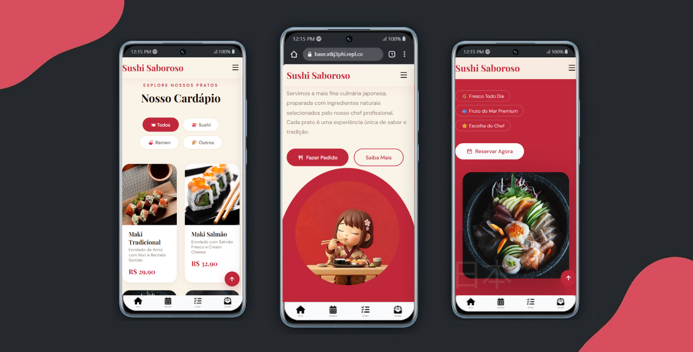

<div align="center">
  <h1 align="center">🍣 Sushi Saboroso — Website de Restaurante Japonês</h1>
</div>



Um website completo de restaurante japonês, construído com **HTML, CSS e JavaScript puros**. Totalmente responsivo, com lightbox, filtro de cardápio interativo e animações suaves.

## 📌 Sobre
Este projeto é uma implementação **focada em aprendizado** de um website profissional para restaurante, explorando:
- **Lightbox customizado** com navegação por setas, teclado e swipe.
- **Filtro de cardápio** interativo por categoria com JavaScript puro.
- **Animações com IntersectionObserver** para efeitos suaves no scroll.
- **Design responsivo** para mobile, tablet e desktop.
- **Hero com vídeo em loop** para uma experiência imersiva.

## 🛠 Tech Stack

- [](https://developer.mozilla.org/pt-BR/docs/Web/HTML) - Estrutura semântica e acessível.
- [](https://developer.mozilla.org/pt-BR/docs/Web/CSS) - Layout, animações e responsividade.
- [](https://developer.mozilla.org/pt-BR/docs/Web/JavaScript) - Lightbox, filtros, validação e scroll.
- [](https://remixicon.com/) - Biblioteca de ícones.
- [](https://fonts.google.com/) - Playfair Display + DM Sans.

## 🚀 Funcionalidades
- 🎥 **Hero animado** com vídeo em loop.
- 🍽️ **Cardápio interativo** com filtro por categoria (Sushi, Ramen, Outros).
- 🖼️ **Lightbox** nas fotos dos pratos — navegação por setas, teclado e swipe.
- 📱 **Layout responsivo** — mobile, tablet e desktop.
- 📧 **Newsletter** com validação completa de e-mail.
- 🎨 **Animações** suaves com IntersectionObserver.
- ⬆️ **Scroll to top** com botão flutuante.

## 📂 Estrutura do Projeto
```
sushi-saboroso/
├── index.html       # Estrutura da página
├── styles.css       # Todos os estilos
├── main.js          # Toda a interatividade
└── sushi-girl.mp4   # Vídeo do hero
```

## 🔧 Como rodar

>[!IMPORTANT]
>Não é necessário instalar nada. Basta ter um navegador moderno.

1. **Clone o repositório:**
   ```bash
   git clone https://github.com/Eduardabarroscbg/sushi-saboroso.git
   ```
2. **Abra no navegador:**
   ```bash
   open index.html
   ```

## 🎨 Paleta de Cores

| Cor | Hex | Uso |
|---|---|---|
| 🔴 Vermelho | `#C1273A` | Destaque e botões |
| 🍷 Vinho | `#3D0A14` | Footer |
| 🟤 Creme | `#FAF3E8` | Fundo principal |
| ⚫ Escuro | `#1C0E08` | Textos |

## 📱 Responsividade

| Dispositivo | Breakpoint |
|---|---|
| Desktop | > 960px |
| Tablet | ≤ 960px |
| Mobile | ≤ 600px |

## 🎯 O que aprendi
- Implementação de **Lightbox do zero** com suporte a teclado e swipe mobile.
- Uso de **IntersectionObserver** para animações performáticas no scroll.
- **Validação de formulário** com JavaScript puro sem bibliotecas externas.
- Boas práticas de **HTML semântico** e acessibilidade.
- Como criar um **layout responsivo** completo só com CSS.

## 🔗 Links
- [Live Demo](https://sushi-saboroso.vercel.app)
- **GitHub:** [@Eduardabarroscbg](https://github.com/Eduardabarroscbg)

---

<div align="center">
Feito com ❤️ por Eduarda Barros
</div>
